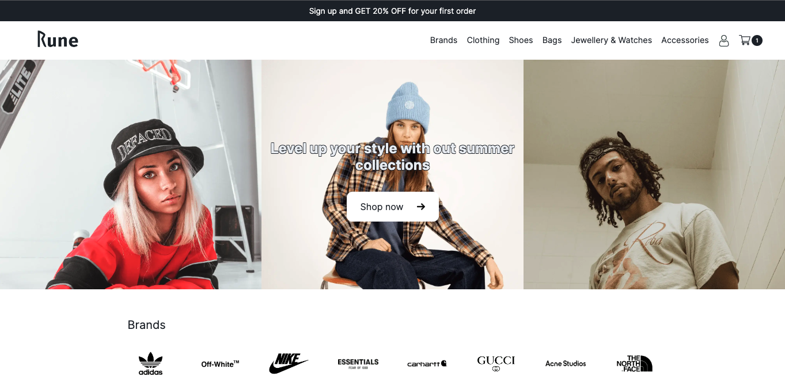
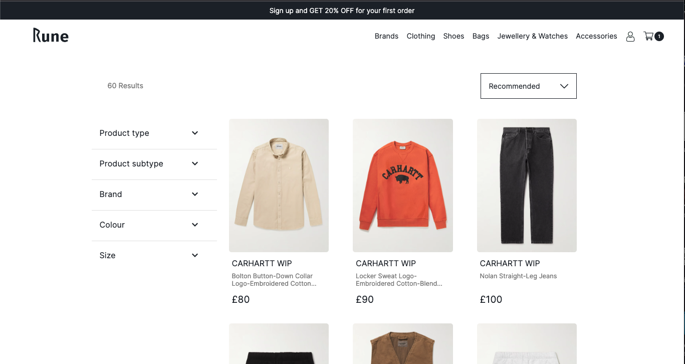
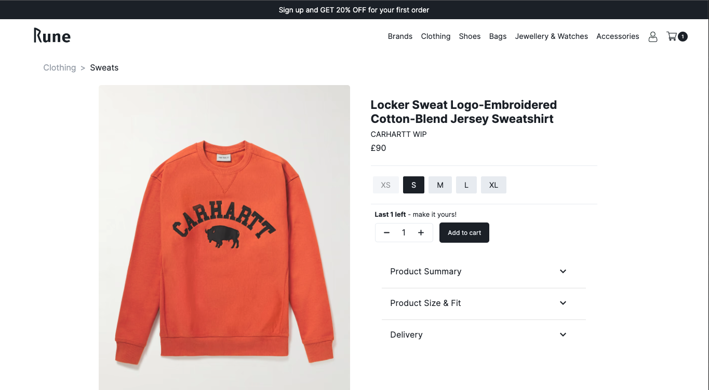

# Rune - eCommerce Fashion Site
## Overview
Rune is an eCommerce fashion site designed to provide an exceptional shopping experience for fashion enthusiasts. It is built using Next.js, incorporating features such as user authentication using bcrypt and seamless payment processing via Stripe integration. Products, user accounts, and order details are securely stored in a MongoDB database.

## Demo
To explore a live demo of Rune, visit Rune [here](https://main--rune-store.netlify.app/).

## Screenshots

## Technologies Used
Front-end:
- Next.js
- Styled Components
- Stripe API for payment processing

Back-end:
- Node.js
- MongoDB for data storage
- bcrypt for user authentication

## Features
User authentication and account creation with secure password hashing.
Browse and filter for fashion products.
Add products to your cart for a seamless shopping experience.
Securely complete orders with Stripe payment integration.
View and track your order history.

## Usage
Sign up for an account or log in using an existing test user (sign in information provided).
Browse the product catalog and add items to your cart.
Proceed to checkout and complete your order securely with Stripe payment.
View your order history in your account dashboard.

## Deployment
Rune is deployed on Netlify, with the database hosted on MongoDB.

## License
This project is licensed under the MIT License. See the [LICENSE](https://chat.openai.com/c/LICENSE) file for details.